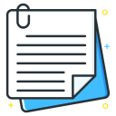

# Facebook Bookmark Extension

  
  <h3>Save and organize your favorite Facebook posts</h3>

## 📖 Overview

Facebook Bookmark is a browser extension that allows you to save and organize your favorite Facebook posts for later reading. It adds a convenient bookmark button to every Facebook post, making it easy to build your personal collection of interesting content.

## ✨ Features

### Post Bookmarking
- **One-Click Saving**: Adds a "Bookmark" button to all Facebook posts
- **Toggle Functionality**: Click again to remove bookmarks
- **Visual Indicators**: Clear visual feedback shows which posts are already bookmarked
- **Metadata Capture**: Saves URL, title, author, and timestamp of each post
- **Duplicate Prevention**: Automatically checks for duplicate bookmarks
- **Post Type Support**: Works with regular posts, photo posts, and shared content

### Bookmark Management
- **Author Grouping**: Organizes bookmarks by post author
- **Flexible Sorting**: Sort by name or date, in ascending or descending order
- **Search Functionality**: Find bookmarks by title, URL, or author
- **Easy Deletion**: Remove unwanted bookmarks with a single click
- **Badge Counter**: Shows the number of saved bookmarks on the extension icon
- **Website Favicons**: Displays Facebook favicon for visual recognition

### User Interface
- **Clean Design**: Modern, Facebook-style interface
- **Responsive Popup**: Well-organized list of all your bookmarks
- **Empty State**: Helpful message when no bookmarks are saved
- **New Tab Opening**: Opens bookmarked posts in a new tab when clicked

### Additional Features
- **Local Storage**: Keeps your bookmarks safe in browser storage
- **Automatic Badge Updates**: Real-time counter of saved bookmarks
- **Error Handling**: Visual feedback for all operations
- **Performance Optimization**: Efficient bookmark button insertion
- **Context Validation**: Safe handling of extension context

## 🔧 Installation

### From Chrome Web Store
1. Visit the [Chrome Web Store](https://chrome.google.com/webstore) (link to be added)
2. Click "Add to Chrome"
3. Confirm the installation

### Manual Installation (Developer Mode)
1. Download or clone this repository
2. Open Chrome and navigate to `chrome://extensions/`
3. Enable "Developer mode" in the top-right corner
4. Click "Load unpacked" and select the extension directory
5. The extension is now installed and ready to use

## 🚀 Usage

1. **Saving Posts**:
   - Browse Facebook as usual
   - Click the "Bookmark" button that appears on any post you want to save
   - A notification will confirm the post has been bookmarked

2. **Managing Bookmarks**:
   - Click the extension icon in your browser toolbar
   - View all your saved bookmarks organized by author
   - Use the search box to find specific bookmarks
   - Sort bookmarks by name or date using the dropdown menus
   - Click on a bookmark to open the original post
   - Click the trash icon to delete a bookmark

## 🔒 Privacy

This extension:
- Only operates on facebook.com domains
- Does not collect or transmit any user data
- Stores all bookmarks locally in your browser
- Requires minimal permissions (storage, tabs, activeTab, clipboardRead)

## 🛠️ Technical Details

- **Framework**: Built with vanilla JavaScript
- **Storage**: Uses Chrome's local storage API
- **Manifest**: Compatible with Manifest V3
- **Icons**: Multiple resolution support (16x16, 48x48, 128x128)
- **Compatibility**: Works with the current Facebook interface

## 🤝 Contributing

Contributions are welcome! Feel free to submit issues or pull requests.

1. Fork the repository
2. Create your feature branch (`git checkout -b feature/amazing-feature`)
3. Commit your changes (`git commit -m 'Add some amazing feature'`)
4. Push to the branch (`git push origin feature/amazing-feature`)
5. Open a Pull Request

## 📄 License

This project is licensed under the MIT License - see the [LICENSE](LICENSE) file for details.

## ☕ Support

If you find this extension useful, consider buying me a coffee!

## 📞 Contact

For questions, suggestions, or issues, please [open an issue](https://github.com/yourusername/facebook-bookmart/issues) on GitHub.

---

  Made with ❤️ for Facebook users who want to save content for later

